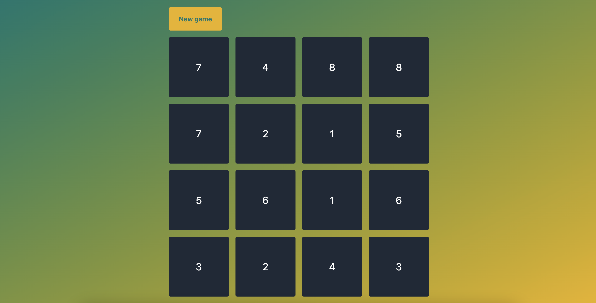
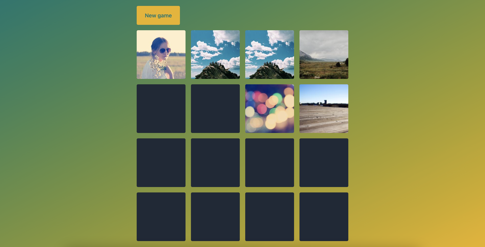
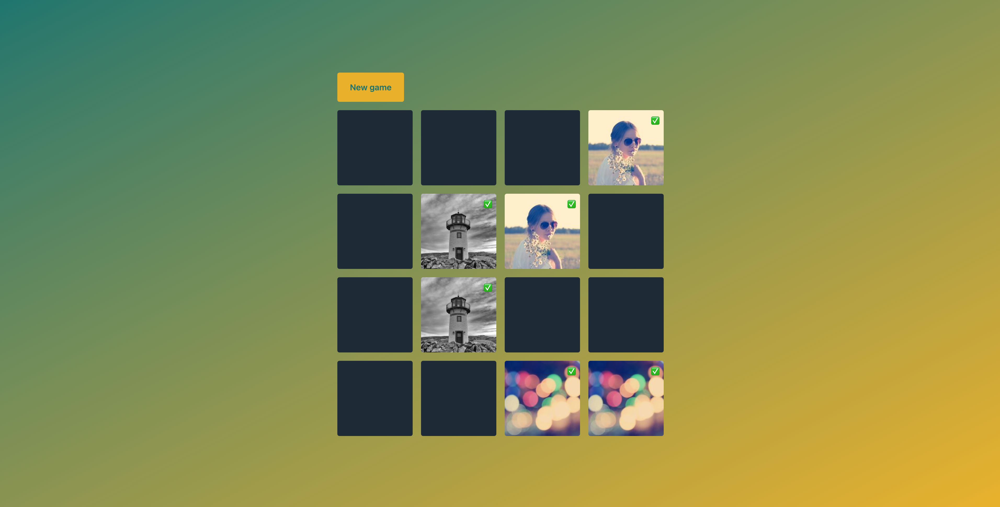

# 🧠 DOM Memory Game

En aquesta activitat crearàs un joc de memoria amb el DOM, HTML i CSS.

## Objectius

- Manipular el DOM directament, afegint i eliminant elements.
- Fer servir CSS per donar estils als elements de la pàgina.
- Afegir gestors d'esdeveniments (event handlers) per interactuar amb les accions que l'usuari faci a la pàgina.
- Gestionar les dades del joc de manera ordenada i estructurada, separades de la visualització
- Implementar la lògica de funcionament del joc de manera ordenada i estructurada, dividint el codi en tantes funcions com calgui.
- Separar la lògica de funcionament del codi de la visualització.

## Configuració

- `npm install` per instal·lar Tailwind CSS.
- `npm start` per a inicialitzar el compilador de Tailwind CSS.
- Obre `index.html` al navegador amb el Live Server de VS Code.

## Requisits bàsics

- Crearem un joc de memoria amb 4 x 4 = 16 cartes (és a dir, 8 parelles).
  Les cartes estaran barrejades de manera aleatòria cada vegada que comencem un joc nou.
- Les cartes es presentaran cap per avall.
- Fer click a una carta li donarà la volta per mostrar-ne el contingut.
- Fer click en dues cartes que formin una parella farà que les cartes queduin descobertes.
- Si descobrim dues cartes que no formen una parella, les cartes tornaran a mostrar-se cap per avall automàticament.
- El joc s'acabarà quan tots els parelles estiguin descobertes.

### 1. Preparació de la baralla

- [ ] Completa la funció `generateCards`.

  - Aquesta funció reb una mida `size` i genera una baralla de cartes amb `size` / 2 parelles.
  - Utilitza almenys un loop per a generar les cartes.
  - La baralla de cartes es guarda a la variable global `cards`.
  - Cada carta té un `id` únic i un valor de 1 a 8 (per parelles). És a dir, la baralla contindrà dues cartes amb el valor 1, dues amb el valor 2, etc. fins al valor 8.
  - Pots generar les cartes de manera ordenada i després utilitzar la funció `shuffle` per a barrejar la baralla (veure següent punt).

- [ ] Completa la funció `shuffle`.

  - Aquesta funció reb un array i ordena els seus elements de manera aleatòria.
  - Utilitza un loop descendent utilitzant una variable `i`. Selecciona una posició aleatòria `j` entre 0 i `i` i intercanvia els elements de la posició seleccionada `j` amb la posició `i`. Aquesta operació es repeteix fins que tots els elements del array han estat intercanvats.
  - Utilitza la funció [`Math.random`](https://developer.mozilla.org/en-US/docs/Web/JavaScript/Reference/Global_Objects/Math/random) per a seleccionar un número aleatòriament.
  - Utilitza la funció [`Math.floor`](https://developer.mozilla.org/en-US/docs/Web/JavaScript/Reference/Global_Objects/Math/floor) per a arrodonir el número aleatori.

### 2. Mostrar la baralla

- [ ] Crea la quadrícula

  - Genera un contenidor grid de 4 x 4 a l'arxiu HTML
  - Aquest grid haurà d'estar posicionat al centre de la pàgina

- [ ] Completa la funció `showCards`.

  - Genera un element `div` per a cada carta de la baralla, i mostra'l dins del grid. Dóna a l'element una classe CSS `card`.
  - El contingut del `div` és el valor de la carta.

- [ ] Afegeix un botó "New Game".

  - Fer click a aquest botó haurà de crear un joc nou.

- [ ] Dóna estils visuals al joc
  - L'estil és lliure. Fes-ho com vulguis.

### 3. Donar la volta a les cartes

- [ ] Marca les cartes com a descobertes.

  - Fer click en una carta ha de marcar-la com a "descoberta". Utilitza `handleCardClick` com a gestor de l'esdeveniment `click` de la carta.
  - Afegeix una propietat nova a cada objecte carta si ho necessites.
  - Completa la funció `flipCard` per a fer això.

- [ ] Visualitza la cara i el revers de cada carta

  - Ara mateix estem mostrant un número per cada carta.
  - Enlloc d'això, s'hauria de mostrar el contingut de la carta només quan aquesta està descoberta.
  - Per això, farem que l'element visual que mostra la carta contingui dos elements:
    - Un element `div` amb una classe `back` que contindrà un color de fons.
    - Un element `div` amb una classe `front` que contindrà el valor de la carta.
    - Per tal de no mostrar mai el valor i el revers de la carta a la vegada, fem que els elements `back` i `front` tinguin una posició `absolute` i que l'element `card` tingui una posició `relative`.
  - Enlloc de mostrar un número, mostra-hi una imatge. Pots utilitzar les teves propies imatges (anomena els arxius `1.png`, `2.png`, etc.) per a una fàcil identificació. També pots utilitzar imatges de [Lorem Picsum](https://picsum.photos/) o un altre servei.

- [ ] Completa la funció `updateCards`.

  - Aquesta funció ha d'afegir o treure la classe `flipped` a cada carta, en funció del seu estat (si està descoberta o no).
  - Selecciona totes les cartes del DOM, i per a cada una de elles, comprova si la carta està descoberta o no (mirant a l'array `cards`).
  - En fer click a cada carta, a més de marcar-la com a descoberta, s'ha de cridar la funció `updateCards` per a actualitzar-ne la visualització.

- [ ] Afegeix estils
  - Quan una carta té la classe `flipped`, s'hauria de veure només el `front` de la carta.
  - Quan una carta no té la classe `flipped`, s'hauria de veure només el `back` de la carta.
  - Pots crear un efecte visual per a això utilitzant la propietat CSS `transform` i aplicant-hi una rotació [`rotateY`](https://developer.mozilla.org/en-US/docs/Web/CSS/transform-function/rotateY). Combina les rotacions de `0deg` i `180deg` en els elements `front` i `back` per crear l'efecte de girar una carta. Per tal de no mostrar la part del darrera d'un element HTML, utilitza la propietat [`backface-visibility: hidden;`](https://developer.mozilla.org/en-US/docs/Web/CSS/backface-visibility)
  - Utilitza [`transition`](https://developer.mozilla.org/en-US/docs/Web/CSS/CSS_Transitions/Using_CSS_transitions) per a animar l'efecte de rotació de cada carta.

### 4. Aplica la lògica del joc al codi

- [ ] Només dues cartes poden estar descobertes al mateix temps.

  - Fes-ho a la funció `flipCard`. Assegura't de donar la volta a una carta només si hi menys de dues cartes descobertes.

- [ ] Marca les cartes com a `matched` quan s'han trobat.

  - Completa la funció `checkMatched` per a fer això. Aquesta funció s'ha de cridar cada cop que donem la volta a una carta.
  - Afegeix una propietat nova a cada objecte carta si ho necessites.
  - Hem trobat una parella si tenim dues cartes destapades i el seu valor es el mateix.
  - Si hem trobat una parella, les cartes s'han de marcar com a `matched`.
  - A la funció `flipCard`, hauràs de tenir en compte les cartes que ja han estat `matched`.

- [ ] Torna a tapar les cartes

  - Completa la funció `flipBack` per a fer això.
  - Aquesta funció marca les cartes com a "no destapades" si n'hem destapat dues pero no són parella.
  - No tinguis en compte les cartes `matched` com a cartes destapades.
  - Aquesta funció s'ha de cridar automàticament al cap d'un segon de destapar cada carta, utilitzant la funció [`setTimeout`](https://developer.mozilla.org/en-US/docs/Web/API/setTimeout).

- [ ] Afegeix un estil visual per a les cartes aparellades

  - Pots remarcar la vora amb un color diferent, mostrar una icona ✅ o algun altre element visual.

- [ ] Comprova si s'han trobat totes les parelles

  - Cada cop que es faci click, cal comprovar si hem acabat el joc.
  - Hem acabat el joc si totes les cartes han estat aparellades.
  - Mostra un missatge de felicitació quan el joc s'hagi acabat.

### 5. Millora el joc (OPCIONAL)

- [ ] Afegeix un comptador de "número de moviments".
- [ ] Afegeix un comptador de temps.
- [ ] ...

## Recursos

- [MDN - Manipulating the DOM Guide](https://developer.mozilla.org/en-US/docs/Learn/JavaScript/Client-side_web_APIs/Manipulating_documents)
- [Plain JS - Common DOM Manipulation methods](https://plainjs.com/javascript/manipulation/)
- [Eloquent JavaScript - The DOM](https://eloquentjavascript.net/14_dom.html)
- [Eloquent JavaScript - Handling Events](https://eloquentjavascript.net/15_event.html)

## Notes

_Aquest és un projecte d'estudiant creat a [CodeOp](http://CodeOp.tech), al bootcamp de Front End Development a Barcelona._
